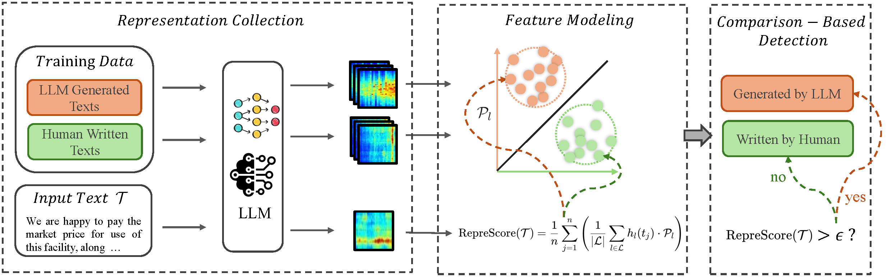

<h2 align="center">
  <a href="https://github.com/NLP2CT/RepreGuard">[TACL 2025] RepreGuard: Detecting LLM-Generated Text by Revealing Hidden Representation Patterns</a>
</h2>

<h5 align="center">
  If you like our project, please give us a star ⭐ on GitHub for the latest update.
</h5>

<p align="center">
  
</p>

<div align="center">

This repository provides the official implementation of **RepreGuard**, a robust and efficient framework for detecting LLM-generated text (LGT) by leveraging hidden representation patterns, achieving state-of-the-art performance in both in-domain and out-of-domain settings.

</div>

---

## 📣 News

- **[2025.08.01]** 🎉 Our paper is accepted by *Transactions of the Association for Computational Linguistics (TACL 2025)*!

---

## 🧐 Overview



**RepreGuard** is based on the hypothesis that the internal representation patterns of LLMs, when processing human-written texts (HWT) and LLM-generated texts (LGT), are distinct and can be systematically modeled. By employing a surrogate model as an observer, we extract neural activation patterns and identify discriminative features. The resulting **RepreScore** enables robust classification between HWT and LGT with minimal training data.

- **Zero-shot detection**: Only a small sample of LGT/HWT pairs is needed for threshold calibration.
- **Strong OOD robustness**: Outperforms all previous methods across different models, domains, text sizes, and attacks.
- **Resource-efficient**: Competitive performance even with smaller surrogate models.

---

## ⚙️ Datasets, Environment and Experimental Reproduction

### Datasets

We use [DetectRL](https://github.com/NLP2CT/DetectRL) dataset, including XSum, Writing Prompts, Yelp Review, and ArXiv abstracts, covering diverse domains and both HWT/LGT pairs generated by ChatGPT, Claude, Google-PaLM, Llama-2-70b, and [RAID](https://github.com/liamdugan/raid) dataset, including the llama-chat, mistral-chat, mpt-chat, mistral, mpt and gpt2 using both greedy and sampling decoding strategies, with and without the application of repetition penalties. The detail in https://drive.google.com/file/d/1mdTBSRLTo7ob-ofithewt8eDTEzZpb7V/view
```bash
wget https://drive.google.com/uc?id=D1mdTBSRLTo7ob-ofithewt8eDTEzZpb7V
unzip datasets.zip
```


### Environment

```bash
conda create -n repre_guard python==3.10
conda activate repre_guard
pip install -r requirements.txt
```

### Running RepreGuard

```bash
python3 repreGuard_evaluation.py \
    --model_name_or_path meta-llama/Llama-3.1-8B \
    --train_data_path datasets/detectrl_dataset/main_dataset/detectrl_train_dataset_llm_type_ChatGPT.json \
    --test_data_paths datasets/detectrl_dataset/main_dataset/detectrl_test_dataset_llm_type_ChatGPT.json, datasets/detectrl_dataset/main_dataset/detectrl_test_dataset_llm_type_Google-PaLM.json, datasets/detectrl_dataset/main_dataset/detectrl_test_dataset_llm_type_Claude-instant.json, datasets/detectrl_dataset/main_dataset/detectrl_test_dataset_llm_type_Llama-2-70b.json \
    --ntrain 512 \
    --batch_size 8 \
    --rep_token 0.1 \
    --bootstrap_iter -1
```

### Surrogate Model Selection

You can specify the LLM surrogate model (e.g., Llama-3-8B, Phi-2, Gemma-2B-Instruct) via the `--model` argument.

---

## 🧪 Overall Results

| Detector      |  ID      |  OOD     | 16-shots |  Text w/ Attack | Text w/ Various Size | Text w/ Various Sampling Methods |
|---------------|----------|----------|----------|-----------------|----------------------|----------------------------------|
| RoBERTa       | 90.85    | 84.26    | 83.60    | 72.97           | 46.81                |  82.17                           |
| Binoculars    | 88.18    | 86.19    | 88.07    | 78.15           | 81.70                |  85.63                           |
| **RepreGuard**| **96.34**| **93.49**| **90.21**| **92.61**       | **84.61**            |  **92.05**                       |

- **Attack**: Paraphrase & Perturbation Attack. 

- **Various Size**: 64 - 256 token size. 

- **Various Sampling Methods**: w/ and w/o Dec. Strategy and Rep. Penalty. 

Please see paper for more detail result.

## ✏️ Citation

If you find our paper/code useful, please cite us and give your ⭐!

```bibtex
@article{chen2025repreguard,
  author       = {Xin Chen, Junchao Wu, Shu Yang, Runzhe Zhan, Zeyu Wu, Ziyang Luo, Di Wang, Min Yang, Lidia S. Chao and Derek F. Wong},
  title        = {RepreGuard: Detecting LLM-Generated Text by Revealing Hidden Representation Patterns},
  journal      = {Transactions of the Association for Computational Linguistics},
  year         = {2025},
  url          = {https://github.com/NLP2CT/RepreGuard},
  note         = {Accepted at TACL 2025}
}
```
